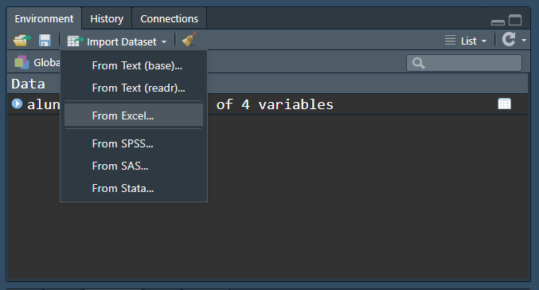
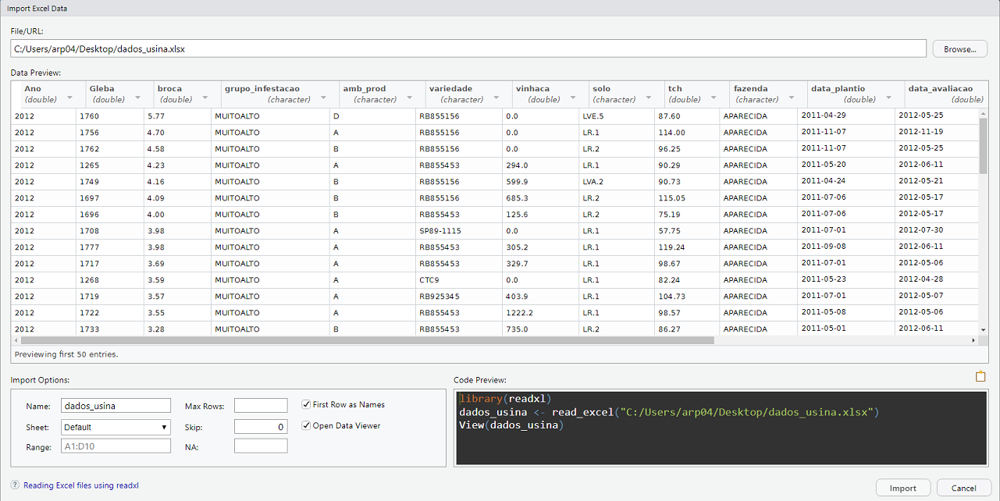
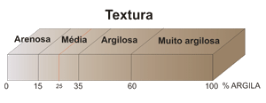

# O R

    

  * O sistema R é um ambiente que incorpora uma implementação da linguagem de programação S, desenvolvida por John Chambers et al. na Lucent Technologies em 1960. 
  
  * 1988: S-Plus é implementado o Software proprietário de análise de dados que contém a linguagem S.
  
  * 1996: Linguagem orientada a objetos R  (Ross Ihaka e Robert Gentleman).

  * R é uma poderosa linguagem, flexível e possui excelentes facilidades gráficas.

  * R é um projeto **open-source** e está disponível na internet sobre a General Public License (www.gnu.org/copyleft/gpl.html e www.fsf.org).


# Instalação do R (sistema base)

Baixe o R do site oficial The R Project for Statistical Computing <https://www.r-project.org/>

Acesso rápido: [Download](<https://cran-r.c3sl.ufpr.br/bin/windows/base/R-4.0.3-win.exe>)


Salve o arquivo de instalação em um diretório de seu computador e em seguida execute-o. 

O processo é simples e intuitivo.

# Instalando o RStudio

É um ambiente de desenvolvimento integrado (IDE) para o R, disponível em <https://rstudio.com/products/rstudio/download/>

Escolha a o instalador de acordo com o seu sistema operacional. **Windows** no nosso caso.

Novamente, salve o arquivo de instalação em um diretório de seu computador e em seguida execute-o.

Após a instalação procure o ícone do R criado pelo instalador e clique nele.

# Pacotes no R (instalação dos pacotes)

Um pacote é uma coleção de funções, exemplos e documentação. A funcionalidade de um pacote é frequentemente focada em uma metodologia estatística especial" (**Everitt & Hothorn**).

 

### Utilizando a opção `Install/Packages`

Instale alguns pacotes:  
 
 * `tidyverse`   
 * `agricolae`  
 * `lawstat`  
 * `nortest`  
 * `lattice`
 * `readxl`
 * `stringr`
 * `lubridate`

# Operações Básicas
### operação aritmética
$$
\begin{aligned}
& a) 1+7 = 8\\
& b)1 - 2 \times10 = 19\\
& c) 2^{10} = 1024\\
& d) \frac{10}{3} = 3.33333
\end{aligned}
$$

```{r eval=FALSE}
1 + 7 # cálculo da soma destes dois números
1 - 2 * 10 # prioridade da multiplicação
2 ** 10 # potências utilizando ** ou ^
10/3 # divisão
```

### funções encontradas em calculadoras científicas
$$
\begin{aligned}
& a)\;\sqrt{9} = 3\\
& b)\;seno\;\pi = 0\\
& c)\;4! = 24\\
& d)\; e^5 = 148.4132
\end{aligned}
$$
```{r eval=FALSE}
sqrt(9) # raiz quadrada
sin(pi) # seno de Pi radianos é zero
factorial(4) #4!=4*3*2*1
exp(5) #exponencial de 5, e^5
```

### operações relacionais

$$
\begin{aligned}
& a)\;7 > 5 \text{ retorna 'true'}\\
& b)\;8 \leq 4 \text{ retorna 'false'}\\
& c)\;5 = \frac{25}{5} \text{ retorna 'true'}\\
& d)\; 4\neq 8 \text{ retorna 'true'}
\end{aligned}
$$

```{r eval=FALSE}
7 > 5 # 7 é maior que 5 ?
8 <= 4 # 8 é menor ou igual a 4?
5 == 25/5 # igual a
4 != 8 # Diferente de
```

**Exercício 1**. Resolva as seguintes expressões:
$$
\begin{aligned}
& a)\; log\;3 \\
& b)\; log_4\;3\\
& c)\; ln\;10\\
& d)\; e^2\\
& e)\; \sqrt(225)\\
& f)\; \frac{25+60\times8}{(14-5)^2}\\
& g)\; 8!\\
& h)\; seno\;30°\\
& i)\; \frac{1}{\sqrt{2\pi}}\cdot e^{-\frac{1}{2}\times4^2}\\
& j)\; \text{Gerar 3 números aleatórios}\\
\end{aligned}
$$

# Principais objetos no R

## Escalar
É um objeto ao qual é atribuído um valor que pode ter qualquer um dos tipos, numérico, caractere, complexo ou lógico.

```{r}
x <- 10
"Maria" -> nome
res  <- (x==20)
```

      Quando uma estrutura de dados é composta de variáveis com o mesmo tipo primitivo, temos um conjunto  de dados homogêneo (vetores, fatores e matrizes). 

## Vetor

É considerada a **forma mais simples de armazenamento de dados** em um objeto, são classificados como variáveis com **um ou mais valores do mesmo tipo**. Na verdade, um escalar para o R é definido como um vetor com um único elemento. 
Essa estrutura de dados tem o 1 como índice inicial. E podem ser referenciados por **[k]** onde k é a posição do elemento no vetor.


```{r eval=FALSE}
z<-c(3,2,7,4,5)
z[3] # o elemento na posição 3 de z é o inteiro 7.
1:10
seq(0,100,25)
rep(1,10)
rep(1:3,4)
rep("testemunha",4)
x<-1:100
is.vector(x)
is.vector(z)
length(z)
```

    Um conjunto heterogêneo de dados é composto por elementos que não são do mesmo tipo primitivo, como exemplo, temos os data.frames e as listas (ou registros).

## Data Frames 
Os data.frames são considerados a **melhor forma de armazenar dados**, pois cada linha corresponde a uma unidade (observação), indivíduo ou pessoa, e cada coluna representa uma medida realizada em cada unidade (característica ou variáveis).

```{r eval=FALSE}
alunos<-data.frame(
  RA=c(1933456,1935432,1869524),
  Nome=c("Maria Eduarda Ferreira","Paulo Antunes Arantes","Ricardo Luís Siqueira"),
  Média=c(9.5,7.75,4.8),
  Situação=c("Aprovado","Aprovado","Exame")
)
alunos
```


# Entrada de dados

## Lendo diretamente da Internet

```{r}
dados <- read.table("https://raw.githubusercontent.com/arpanosso/pedometria/main/dados/geomorfologia.txt",
                          h=TRUE,
                          sep="\t")
```

## Banco de dados em TXT
Faça o download do banco de dados [geomorfologia.txt](https://raw.githubusercontent.com/arpanosso/pedometria/main/dados/geomorfologia.txt)

```{r}
dados <- read.table("C:/R/geomorfologia.txt",h=TRUE,sep="\t")
```
## Banco de dados do Excel

Faça o download do banco de dados [geomorfologia.xlsx](https://github.com/arpanosso/pedometria/raw/main/dados/geomorfologia.xlsx)





```{r}
library(readxl)
geomorfologia <- read_excel("dados/geomorfologia.xlsx")
View(geomorfologia)
```

# Manipulação dos dados

Para a manipulação dos nossos dados, vamos utilizar o pacote `dplyr`, que é um pacote específico para a manipulação de dados, unido ao pacote `ggplot2` é um poderoso recurso para exploração, transformação e visualização de dados. Ambos os pacotes fazem parte o `tidyverse`, que é um pacote de pacotes.

## Principais funções (verbos) do `dplyr`.  

  * `filter()`: seleciona/filtra por linhas (observações) a base de dados  
  * `arrange()`:  ordena a base de dados de acordo com alguma coluna (variável)  
  * `select()`:  seleciona colunas (variáveis)  
  * `mutate()`:  modifica/transforma/cria variáveis (colunas)  
  * `summarise()`:  resume/agrega, variáveis (colunas) de uma base de dados  

## Regras para manipulação:  
   1- O primeiro argumento sempre será um `data.frame`.  
   2- Demais argumentos, descrevem como deve ser a manipulação.  
   3- A resposta sempre será um `data.frame`.  
   4- Manipulação é realizada com o operador "PIPE" (`%>%`) - `CTRL SHIFT + M`.  

### Carregando os pacotes
```{r}
library(tidyverse) # um pacote de pacotes...
```

**Exercício 2**. Execute a função `glimpse` para uma visão rápida a respeito das variáveis do banco de dados.
```{r echo=FALSE}
glimpse(dados)
```

**Exercício 3**. Selecione as **linhas** para superfície igual a "II".
```{r eval=FALSE}
dados %>% 
  filter(SUP == "II")
```

**Exercício 4**. Crie outro banco de dados para aqueles registros com ARGILA maior que 10, provenientes da superfície "I".
```{r}
df<-dados %>% 
  filter(ARGILA > 10, SUP == "III") 
```

**Exercício 5**. Desse novo objeto, selecione todas as observações que não pertençam ao solo "R".
```{r eval=FALSE}
df %>% 
  filter(Solo != "R")
```


**Exercício 6**. Dos dados originais faça uma contagem de quantos pontos existem em cada uma dessas superfícies.
```{r eval=FALSE}
dados %>% 
  group_by(SUP) %>% 
  count(SUP) 
```

**Exercício 7**. Selecione todos os Latossolos?
```{r eval=FALSE}
library(stringr)
dados %>% 
  filter(str_detect(Solo,"^L"))
levels(as.factor(dados$Solo))
```


**Exercício 8**. Selecione os registros cujo solo é "PV4"?
```{r eval=FALSE}
dados %>% 
  filter(str_detect(Solo,"PV4")) 
```

**Exercício 9**. Selecione os registros cujo nome do solo termina com o "p"?
```{r eval=FALSE}
dados %>% 
  filter(str_detect(Solo,"p$"))
```

**Exercício 10**. Ordene os registros por ordem crescente de teor de ARGILA
```{r eval=FALSE}
dados %>% 
  arrange(ARGILA)
```

**Exercício 11**. Ordene os registros por ordem decrescente de "H_Al".
```{r eval=FALSE}
dados %>% 
  arrange(desc(H_Al))
```

**Exercício 12**. Calcule a soma dos teores de ARGILA + SILTE, em seguida transforme o teor de fósforo para a escala logarítmica.
```{r eval=FALSE}
dados %>% 
  mutate(
    ARG_SILT = ARGILA + SILTE,
    log_P = log10(P)
  )
```

**Exercício 13**. Classifique a Textura do solo.


```{r eval=FALSE}
range(dados$ARGILA)
dados %>% 
  mutate(
    TEXTURA = case_when(
      ARGILA < 15 ~ "Arenosa",
      ARGILA <= 35 ~ "Media",
      ARGILA <= 60 ~ "Argilosa",
      ARGILA > 60 ~ "Muito argilosa",
      TRUE ~ "Sem classificação")
  )
```

**Exercício 14**. Calcule as estatísticas descritivas para alguns atributos do solo de sua preferência. 

```{r eval=FALSE}
library(agricolae)
dados %>% 
  group_by(SUP) %>% 
  summarise(N=length(Ca),
            media = mean(Ca),
            mediana =median(Ca)
  )
```

## Gráficos usando o ggplot2

**Exercício 15**. Construa um gráfico de dispersão entre P e Ca.
```{r}
# chamar os dados
# filtrar, agrupar, gerar estatísticas se necessário
# adicionar as camadas gráficas

# Gráfico de Dispersão
dados %>% 
  ggplot(aes(x=P,y=Ca) ) + # dizer quem será o x e o y dentro de aes
  geom_point()
```

**Exercício 16**. Construa um gráfico de dispersão entre a ARGILA e SILTE do ar, mapeie as Superfícies por meio das cores no novo gráfico.
```{r}
# Gráfico de Dispersão
dados %>% 
  ggplot(aes(x=ARGILA,y=SILTE,color=SUP) ) + # dizer quem será o x e o y dentro de aes
  geom_point()+
  geom_smooth(aes(x=ARGILA,y=SILTE))
```

**Exercício 17**. Construa um gráfico de dispersão entre a ARGILA e SILTE, mapeie as Superfícies por meio das formas dos marcadores no novo gráfico.
```{r}
dados %>% 
  ggplot(aes(x=ARGILA,y=SILTE)) + 
  geom_point(aes(shape=as.factor(SUP)),color="red")
```


**Exercício 18**. Adicione os títulos dos gráficos, eixos e legendas.
```{r}
dados %>% 
  ggplot(aes(x=ARGILA,y=SILTE) ) + # dizer quem será o x e o y dentro de aes
  geom_point(aes(shape=as.factor(SUP)),color="red")+
  theme_minimal()+
  labs(x="Teor de Argila (%)",y="Teor de Silte (%)",shape="Superfície") +
  ggtitle("Gráfico de dispersão",subtitle = "Pedometria")
```

**Exercício 19**. Criar um gráfico de barras, com os solos presentes na superfície "III".
```{r}
dados %>% 
  filter(SUP=="III") %>% 
  group_by(Solo) %>% 
  summarise(n=n()) %>% 
  mutate(perc=n/sum(n)) %>% 
  ggplot(aes(x=Solo, y=perc))+
  geom_col()
```

**Exercício 20**. Altere os eixos as cores do gráfico anterior.

```{r}
# Gráfico de Barras
dados %>% 
  filter(SUP=="III") %>% 
  group_by(Solo) %>% 
  summarise(n=n()) %>% 
  mutate(perc=n/sum(n)) %>% 
  ggplot(aes(x=Solo, y=perc))+
  geom_col(fill="aquamarine4") +
  coord_flip()
```


**Exercício 21**. Ordene o banco de dados dos Solos mais observados para os menos observados.
```{r}
# Gráfico de Barras
dados %>% 
  group_by(Solo) %>% 
  summarise(n=n()) %>% 
  mutate(perc=n/sum(n),
         Solo = Solo %>% fct_lump(n=10,w=perc) %>% fct_reorder(perc)) %>% 
  ggplot(aes(x=Solo, y=perc))+
  geom_col(fill="salmon") +
  coord_flip()
```


**Exercício 22**. Criar o gráfico de colunas para as médias de Teor de ARGILA para cada Solo.
```{r}
dados %>% 
  group_by( Solo) %>% 
  summarise(argila=mean(ARGILA)) %>% 
  ggplot(aes(x=Solo,y=argila,fill=as.factor(Solo))) +
#  geom_col(position = "stack") +
  geom_col(position = "dodge")
```

**Exercício 23**. Adicione a linha de tendência linear entre ARGILA e SILTE para cada SUP.
```{r}
# Gráfico das médias por ano em cada fazenda
dados %>% 
  group_by(SUP) %>% 
  ggplot(aes(x=ARGILA,y=SILTE,color=as.factor(SUP))) +
  geom_point()+
  facet_wrap(~SUP)+  # scales = "free", se necessário
    geom_smooth(mapping = aes(x=ARGILA, y=SILTE), 
              method="lm",
              color="red",lwd=.6,lty=2, 
              se=FALSE)
```

**Exercício 24**. Construa o gráfico de distribuição de frequência para as variáveis contínuas do banco de dados.
```{r}
# Hitograma das variáveis contínuas
dados %>% 
  group_by(SUP) %>% 
  ggplot(aes(x=ARGILA))+
  geom_histogram(aes(y=..density..),color="black",fill="white",bins=30)+
  geom_density(alpha=.2,fill="salmon")+
  geom_vline(aes(xintercept=mean(ARGILA)),color="blue",size=1.6,linetype="dashed")
```
**Exercício 25**. Construa o gráfico de distribuição de frequência para uma variável específica em cada superfície.

```{r}
dados %>% 
  group_by(SUP) %>% 
  ggplot(aes(x=Ca))+
  geom_histogram(aes(y=..density..),color="black",fill="white",bins=30)+
  geom_density(alpha=.2,fill="salmon")+
  facet_wrap(~SUP,scales = "free")
```


## Exemplo de Violin plot  
```{r}
dados %>%
  ggplot(aes(y=ARGILA,x=as.factor(SUP),fill=as.factor(SUP))) +
  geom_violin(trim = FALSE) +
  stat_summary(fun = mean, geom = "point",shape=23,size=2,color="black",fill="gray")

dados %>%
  ggplot(aes(y=Ca,x=as.factor(SUP),fill=as.factor(SUP))) +
  geom_violin(trim = FALSE) +
  stat_summary(fun = mean, geom = "point",shape=23,size=2,color="black",fill="gray")
```

# Alguns testes inferenciais 

## Testes de comparação de médias  
**Exercício 26**. Verifique se as variâncias do teor de Ca são semelhantes para  as superfícies "I" e "II".
```{r}
da<-dados %>%
  filter(SUP!="III") 
var.test(da$Ca~da$SUP)
```


**Exercício 27**. Verifique se as médias do teor de Ca são semelhantes para as superfícies "I" e "II".
```{r}
t.test(da$Ca~da$SUP,var.equal=TRUE)
```
## Normalidade  
**Exercício 28**. Para os dados de Ca para a Superfície "I", realize o teste de normalidade.

```{r}
library(nortest)
da<-dados %>% 
  filter(SUP=="I")

da %>% 
  ggplot(aes(x=Ca)) +
  geom_histogram(aes(y=..density..),color="black",fill="white",bins=30)

shapiro.test(da$Ca)
cvm.test(da$Ca)
lillie.test(da$Ca)
ad.test(da$Ca)
```

## Homocedasticidade e normalidade do erros na Análise de Variância

**Exercício 29**. Realize a ANOVA (análise de variância) para verificar o efeito das superfícies nos teores de ARGILA.
```{r}
library(lawstat)
mod<-aov(ARGILA~as.factor(SUP),data=dados)
anova(mod)
levene.test(dados$ARGILA,dados$SUP)
res<-rstudent(mod)
hist(res)
shapiro.test(res)
ad.test(res)
lillie.test(res)
cvm.test(res)
```
# Referências

TEETOR, P. R Cookbook. USA: O’Reilly Media, Inc, https://rc2e.com/.